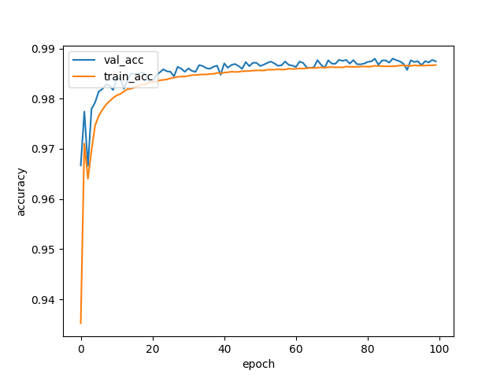
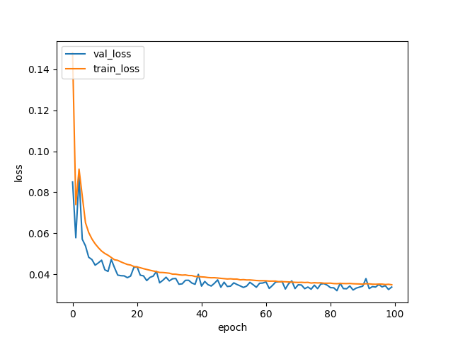
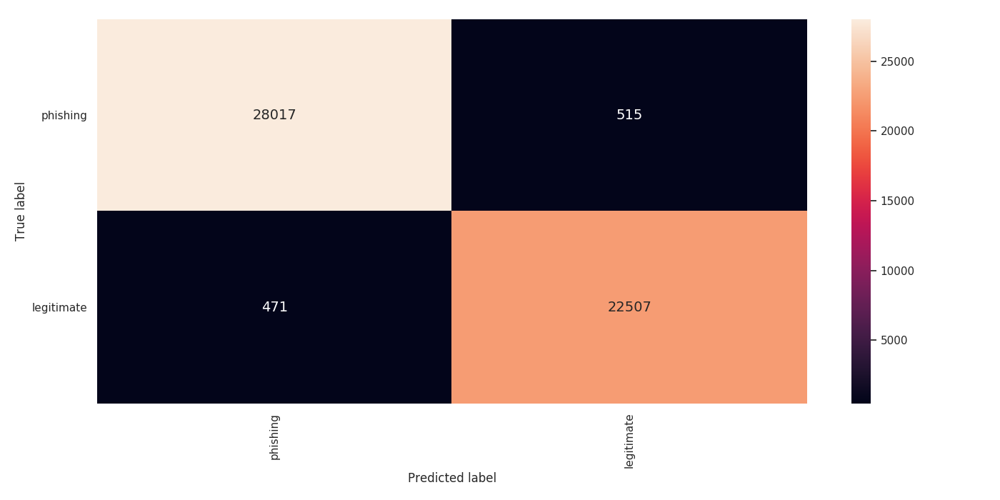
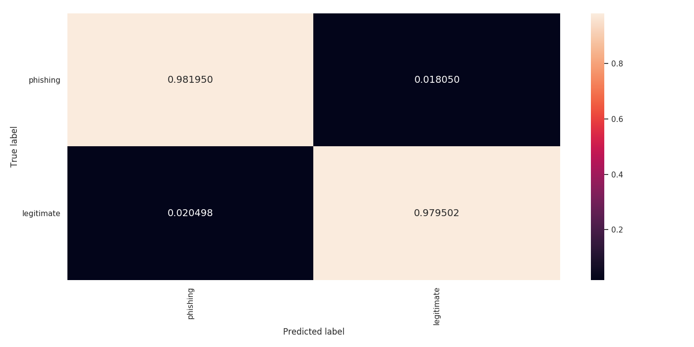
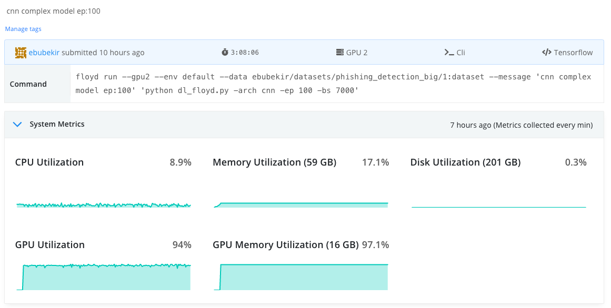
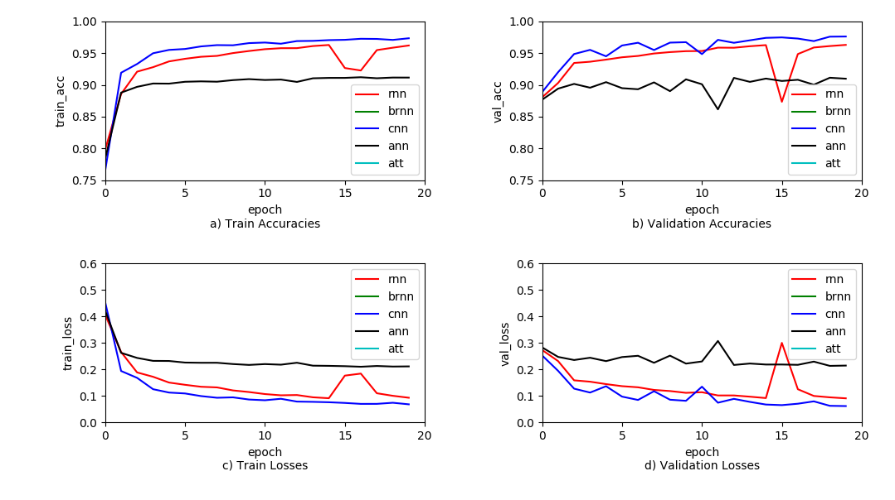

# DEPHIDES: Deep Learning Based Phishing URL Detection System

[[Paper]](link) [[Blog Post]](link)

This project has been developed to detect Phishing URLs using Deep Learning. A comprehensive dataset has been collected for this purpose.
This data set has been shared so that one can use them in their own studies. The data set consists of two classes: Phishing URLs and Legitimate URLs.

### Installation / Clone and install requirements
    $ git clone https://github.com/ebubekirbbr/phishing_url_detection.git
    $ cd phishing_url_detection/
    $ sudo pip install -r requirements.txt


#### Dataset

The data set has been prepared as 2 different versions. The data set was shared in two versions due to the fact that the researchers could easily reproduce the tests and hardware limitations.
The first version (small_dataset) was prepared using a 10% sub-sample of all dataset. The other version (big_dataset) contains the entire data.
In this study, the scenarios tested were run on the small_dataset.
The most successful configuration that was selected as a result of the analysis on small_dataset was applied to big_dataset. 

Both versions were divided into 3 parts: train, validation and test. The proportions used in the split process are as follows; train: 0.7, val: 0.2 and test: 0.1

The details of the data set are as follows;

| Dataset          | Train        | Validation   |  Test          | Overall    |
| ---------------- |:------------:|:------------:|:--------------:|:----------:|
| small_dataset    | 364,199      | 104,576      |   51,510       |   520,285  |
| big_dataset      | 3,641,986    | 1,045,774    |  515,080       | 5,202,841  |


| Dataset          | Phishing        | Legitimate   |  Overall    |
| ---------------- |:------------:|:------------:|:--------------:|
|   small_dataset  | 232,090      | 288,195      |    520,285     |
|   big_dataset    | 2,320,893    | 2,881,948    |  5,202,841     |

Phishing URLs are collected from [Phishtank](http://phishtank.com/), Legal URLs are collected from [Commoncrawl](http://commoncrawl.org/).
Please read the [article](link) for detailed information.

Datasets are shared under `dataset/` folder. The dataset folder has the following structure.

```
dataset/
├── big_dataset
│   ├── meta.txt
│   ├── test.txt
│   ├── train.txt
│   └── val.txt
├── small_dataset
│   ├── meta.txt
│   ├── test.txt
│   ├── train.txt
│   └── val.txt
├── top100k_cc.txt
└── top_100k_errored_cc.txt
```
`meta.txt` contains information about the sample counts in the datasets. 
`top100k_cc.txt` contain legal domains from the CommonCrawl. These domains were used to collect legitimate URLs.


## Train

There are 2 main scripts in this project. 
`dl.py` is the script that performs the necessary operations for the training and testing.
`dl_models.py` 'is the script that contains the model architectures tested.

`dl.py`  parameters are as follows.

```
$ dl.py [-h] [-ep EPOCH] -arch ARCHITECTURE [-bs BATCH_SIZE]

optional arguments:
  -h, --help            show this help message and exit
  -ep EPOCH,          --epoch EPOCH
                            The number of epoch
  -arch ARCHITECTURE, --architecture ARCHITECTURE
                            Architecture function in dl_models.py
  -bs BATCH_SIZE,     --batch_size BATCH_SIZE
                        batch size

```

A model in `dl_models.py` must be selected for train process.
The function name should be given to the `dl.py` script as a architecture parameter.


An example usage;

```
python dl.py -arch cnn_base
```


The epoch number and batch size can be given as parameters for train. For example;
```
python dl.py -arch cnn_base -ep 30 -bs 1000
```

#### Training log
```
.
.
.
Total params: 449,044
Trainable params: 449,044
Non-trainable params: 0
_________________________________________________________________
Instructions for updating:
Use tf.cast instead.
Train on 10 samples, validate on 10 samples
Epoch 1/10
14000/3641986 [==============================] - 118s 32us/step - loss: 0.1481 - acc: 0.9352 - val_loss: 0.0850 - val_acc: 0.9667
Epoch 2/10
21000/3641986 [==============================] - 118s 32us/step - loss: 0.1481 - acc: 0.9352 - val_loss: 0.0850 - val_acc: 0.9667
.
.
.
```

#### Tested Deep Learning Models


The available models tested in the article are as follows;
```
rnn_base
brnn_base
cnn_base
ann_base
att_base
rnn_complex
brnn_complex
ann_complex
att_complex
cnn_complex
cnn_complex2
cnn_complex3
```

### Define Custom DL Model
If you want to train your own model, all you need to do is define the model into `dl_models.py`.
Then you should run your own model with as follows;
```
python dl.py -arch custom_model
```

It is worth repeating that you should give the function name of the model you defined in `dl_models.py` as a parameter. 
For the example above, the model you create in `dl_models.py` must be defined in the function named `custom_model`.

### Test Results

Many information about the test results described in the article are shared in the `test_results` folder. Shared assets for each test performed are as follows.
```
.
├── accuracy.png                    : Accuracy Graphic
├── char_embeddings.json            : Character Embeddings (dim. 50), if you want to use transfer learning, you can use this embeddings
├── classification_report.txt       : Precision, Recall, F-Measures
├── confusion_matrix.png            : Confusion Matrix
├── floyd_command.txt               : The command used to run the test in Floydhub
├── gpu_utilization.png             : Resources consumed during running
├── loss.png                        : Loss Graphics
├── model.json                      : Model (only json)
├── model_all.h5                    : Model with Weights
├── model_summary.txt               : Model Summary
├── normalized_confusion_matrix.png : Normalized Confusion Matrix
├── raw_test_results.json           : All debug info as json
└── weights.h5                      : Model Weights

```
The most successful model in the article was cnn_complex1 on big dataset. Test results for cnn_complex model as follows;
> path of assets: 'test_results/big_dataset/'

##### Model Summary
```
_________________________________________________________________
Layer (type)                 Output Shape              Param #   
=================================================================
embedding_1 (Embedding)      (None, 200, 50)           4900      
_________________________________________________________________
conv1d_1 (Conv1D)            (None, 198, 128)          19328     
_________________________________________________________________
max_pooling1d_1 (MaxPooling1 (None, 66, 128)           0         
_________________________________________________________________
dropout_1 (Dropout)          (None, 66, 128)           0         
_________________________________________________________________
conv1d_2 (Conv1D)            (None, 66, 128)           114816    
_________________________________________________________________
dropout_2 (Dropout)          (None, 66, 128)           0         
_________________________________________________________________
conv1d_3 (Conv1D)            (None, 66, 128)           82048     
_________________________________________________________________
dropout_3 (Dropout)          (None, 66, 128)           0         
_________________________________________________________________
conv1d_4 (Conv1D)            (None, 66, 128)           49280     
_________________________________________________________________
max_pooling1d_2 (MaxPooling1 (None, 22, 128)           0         
_________________________________________________________________
dropout_4 (Dropout)          (None, 22, 128)           0         
_________________________________________________________________
conv1d_5 (Conv1D)            (None, 22, 128)           82048     
_________________________________________________________________
dropout_5 (Dropout)          (None, 22, 128)           0         
_________________________________________________________________
conv1d_6 (Conv1D)            (None, 22, 128)           49280     
_________________________________________________________________
max_pooling1d_3 (MaxPooling1 (None, 7, 128)            0         
_________________________________________________________________
dropout_6 (Dropout)          (None, 7, 128)            0         
_________________________________________________________________
conv1d_7 (Conv1D)            (None, 7, 128)            49280     
_________________________________________________________________
max_pooling1d_4 (MaxPooling1 (None, 2, 128)            0         
_________________________________________________________________
dropout_7 (Dropout)          (None, 2, 128)            0         
_________________________________________________________________
flatten_1 (Flatten)          (None, 256)               0         
_________________________________________________________________
dense_1 (Dense)              (None, 2)                 514       
=================================================================
Total params: 451,494
Trainable params: 451,494
Non-trainable params: 0
_________________________________________________________________
```

##### Accuracy And Loss

<p align="center">
</p>

##### Confusion Matrixes

<p align="center">
</p>

##### Performance Metrics
```
              precision    recall  f1-score   support

    phishing       0.98      0.99      0.99    285314
  legitimate       0.99      0.98      0.99    229766

   micro avg       0.99      0.99      0.99    515080
   macro avg       0.99      0.99      0.99    515080
weighted avg       0.99      0.99      0.99    515080

```
##### Gpu Utilization
<p align="center"></p>

A deep learning-based phishing URL detection system was developed in this project. 5 different deep learning architecture were tested in total. Deep learning architectures tested are as follows;
- Artificial Neural Network (ANN)
- Convolutional Neural Networks (CNN)
- Recurrent Neural Networks (RNN)
- Bidirectional Recurrent Neural Networks (BRNN) (can not be applied on some tests due to hardware constraints)
- Attention Networks (AN) (can not be applied on some tests due to hardware constraints)

Tests were performed on small_dataset due to hardware constraints. The most successful model architecture was run on big_dataset.
Comparative test results on small_dataset with complex architecture are given below.

<p align="center"></p>

> To more details and more comparative results please read the paper.


## Credit


_Ebubekir BUBER_ <br>


[[Paper]](link) [[Blog Post]](link)


```
@article{DEPHIDES,
  title={DEPHIDES: Deep Learning Based Phishing URL Detection System},
  author={Ebubekir BUBER},
  journal = {arXiv},
  year={2019},
  mail={ebubekirbbr@gmail.com}
}
```